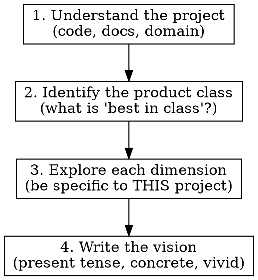

# Envision

## Overview

Analyze a project deeply, then describe what the absolute best version of it would look like — as if time, money, and resources were unlimited. The output is a vivid, specific vision document written in present tense. Not a roadmap. Not a feature list. A portrait of the destination.

## When to Use

- Establishing a north star for a new or existing project
- Reassessing ambition after significant progress
- Helping stakeholders understand what the product _could_ be
- Creating a reference point for prioritization ("how close does this get us to the vision?")

## When NOT to Use

- You need an actionable plan → use superpowers:writing-plans
- You need to prioritize within constraints → that's product management
- The user wants incremental improvements → just make the improvements

## Process

### 1. Understand the Project

Use parallel Explore agents to deeply understand:

- What the project does today (features, data, architecture)
- Who it serves and what problems it solves
- Existing vision/roadmap docs (check `docs/` for vision, roadmap, veikart, strategy)
- Current limitations, trade-offs, and known gaps

Read broadly. You cannot envision what you don't understand.

### 2. Identify the Product Class

Determine what category this product belongs to and what the frontier looks like:

- What existing products occupy this space? (competitors, adjacent tools, historical precedents)
- What do power users of these products wish for?
- What would make this product the _obvious_ choice for its audience?
- What would make experts in the domain say "finally, someone built this right"?

Use WebSearch if needed to understand the competitive landscape and domain best practices.

### 3. Explore Each Dimension

For each dimension below, describe the ideal. Be ruthlessly specific to THIS project — generic platitudes are worthless.

| Dimension          | Guiding question                                                                                                    |
| ------------------ | ------------------------------------------------------------------------------------------------------------------- |
| **Experience**     | What does using it _feel like_? What's the moment of delight? What's effortless that used to be painful?            |
| **Data & Content** | What would it know? How complete, how fresh, how trustworthy? What data would it combine that nobody else combines? |
| **Intelligence**   | What would it understand, infer, or anticipate without being told?                                                  |
| **Performance**    | How fast? How reliable? What happens when things go wrong?                                                          |
| **Reach**          | Who else could use it? What barriers to access are gone?                                                            |
| **Integration**    | What does it connect to? What workflows does it slot into seamlessly?                                               |
| **Trust**          | Why would users trust it completely? What proof does it offer?                                                      |
| **Craft**          | What details would make domain experts admire it? What shows deep understanding of the work?                        |
| **Scale**          | What happens when usage grows 100x? What new possibilities emerge at scale?                                         |

Skip dimensions that don't apply. Add dimensions that do — the table is a starting point, not a checklist.

### 4. Write the Vision

**Format:** Prose organized by theme. Each section paints a picture of the product in its ideal state.

**Rules:**

| Rule                               | Example                                                                                    |
| ---------------------------------- | ------------------------------------------------------------------------------------------ |
| Write in present tense             | "The system maintains..." not "it would maintain..."                                       |
| Describe experiences, not features | "When a user searches, they see..." not "search feature with filtering"                    |
| Be concrete                        | "Results appear in <100ms with faceted filtering across 12 dimensions" not "fast search"   |
| No hedging                         | "It does X" not "ideally it could X"                                                       |
| No implementation details          | Don't mention databases, frameworks, APIs — describe what the user sees and gets           |
| No phasing or sequencing           | This is the end state, not a journey                                                       |
| Close with synthesis               | End with a paragraph that captures the essence — what this product _is_ when it's complete |

**Length:** 500–2000 words depending on project complexity. Thorough but not exhaustive — every sentence should earn its place.

**Output location:** Write to `docs/visjon.md` (or the project's equivalent). If one already exists, update it — visions should evolve as understanding deepens. If the user asks for a different location, use that.

## Common Mistakes

| Mistake                                                  | Fix                                                                                                          |
| -------------------------------------------------------- | ------------------------------------------------------------------------------------------------------------ |
| Writing a feature list disguised as prose                | Each section should describe an _experience_ or _capability_, not list bullet points of things to build      |
| Being generic ("world-class UX", "seamless integration") | Force yourself to be specific: _what_ is seamless? _How_ does the UX delight?                                |
| Slipping into planning ("first we'd need to...")         | Delete the sentence. Describe the end state only.                                                            |
| Ignoring the domain                                      | The vision should demonstrate deep understanding of _how users actually work_ — not just what features exist |
| Copying competitors                                      | Describe the ideal, not a mashup of existing products. Competitors are input, not output.                    |
| Being too short                                          | A one-paragraph vision is a tagline, not a north star. Explore dimensions thoroughly.                        |
| Being too long                                           | A 5000-word vision is a spec. Keep it vivid and readable.                                                    |
